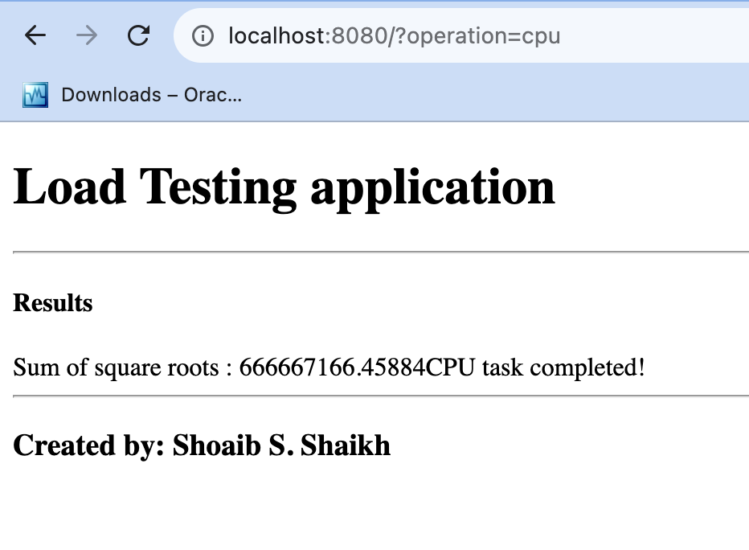
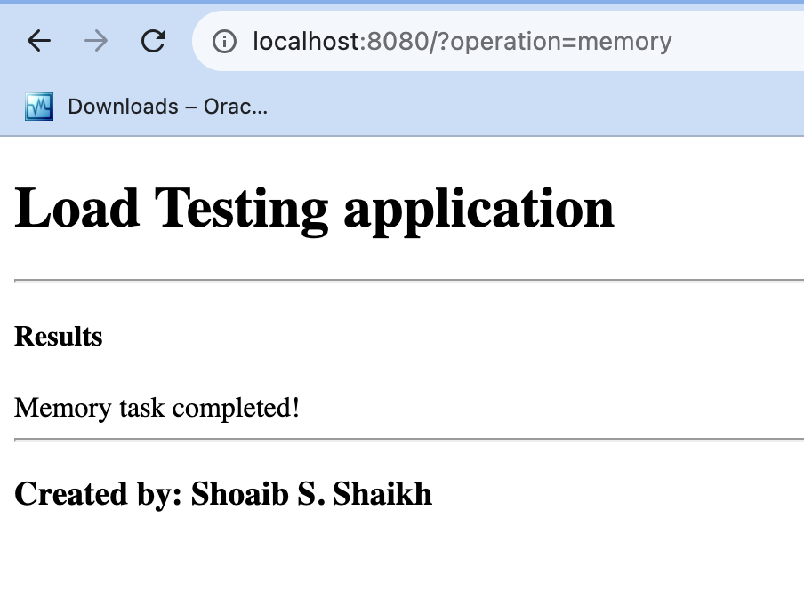
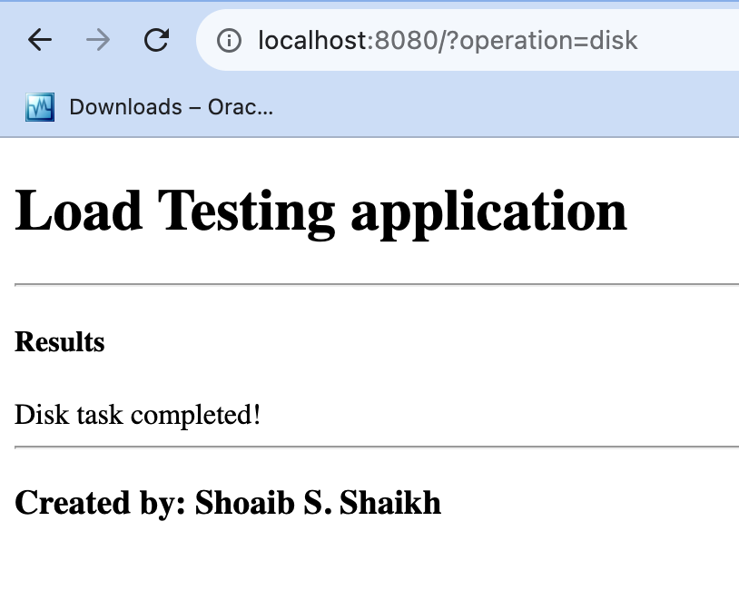
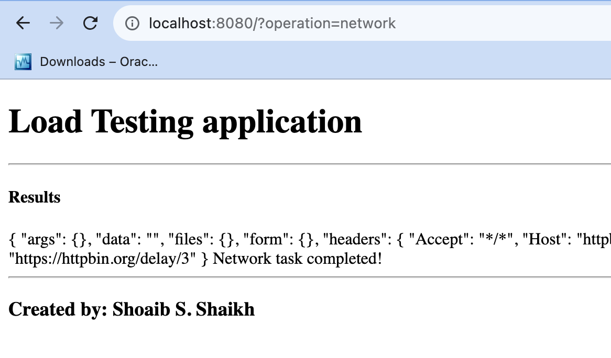

# PHP Load Testing

This application performs various hardware resource intensive operations.

## How to use this application

Add the request parameter "operation" after the url as follows:

```
http://localhost:80?operation=<OPERATION>

OPERATION:
'cpu' => CPU Intensive
'memory' => Memory Intensive
'disk' => Disk Intesnsive
'network' => Network Intensive
```

## How to deploy this application

```
docker compose up
```

## How this application works

CPU intensive workload calculates sum of square roots of all numbers in a range.

Memory intensive workload initializes an array of predefined length in RAM.

Disk intensive workload writes a string certain number of times and stores on the disk.

Network intensive workload hits a URL that responds after a certain amount of time.

## Screenshots







